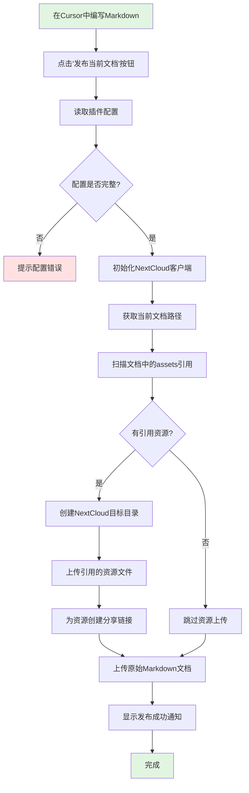
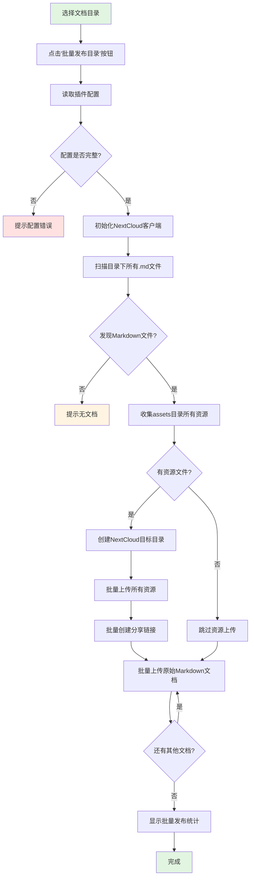

# 文档发布插件 (Cursor Plugin)

[](https://open-vsx.org/extension/shon-chen/cursor-doc-publish-plugin)
[](https://github.com/chengang12345632/cursor-doc-publish-plugin/blob/main/LICENSE)

Cursor/VSCode 插件，用于在编辑器中一键发布项目文档到 NextCloud。

---

## 1. 插件用途

在项目开发过程中，需要编写和维护各种文档（设计文档、需求文档、技术文档、API文档等）。本插件解决以下问题：

**问题场景**：
- 📝 项目文档包含大量图片、附件，直接提交到Git会导致仓库体积膨胀
- 🔗 图片资源分散存储，文档中的引用链接难以维护
- 🌐 需要将文档发布到团队共享平台（NextCloud），方便查阅和分享
- 🔄 手动上传资源、发布文档，操作繁琐易出错
- 💻 需要在编写文档后切换到终端执行命令，打断工作流

**解决方案**：
- ✅ 在项目中创建 `doc` 目录，在Cursor中编写Markdown文档
- ✅ 图片、PDF等资源放在 `assets` 目录，使用相对路径引用
- ✅ 在Cursor中点击按钮或执行命令，自动上传资源和文档到NextCloud
- ✅ 无需切换终端，在编辑器内完成整个发布流程

## 2. 支持的文档类型

- 📋 **设计文档**：架构设计、详细设计、数据库设计
- 📄 **需求文档**：需求规格、用户故事、功能说明
- 🔧 **技术文档**：技术方案、调研报告、最佳实践
- 📚 **开发文档**：开发指南、部署文档、运维手册
- 📊 **项目文档**：项目计划、会议记录、总结报告

## 3. 核心功能

- 🔄 智能上传：只上传文档中实际引用的资源文件
- 📚 自动发布Markdown原始文档到NextCloud（保持相对路径引用）
- 🗂️ **动态目录选择**：发布时弹出对话框，支持输入新目录或选择历史记录
- 🖱️ Cursor编辑器内一键发布，无需切换终端
- 📊 实时显示上传进度和结果
- 📄 支持单个文档发布和批量目录发布两种模式
- 🔗 为资源文件创建NextCloud分享链接（可选查看）
- 💾 节省存储：不上传未使用的资源文件

## 4. 工作流程

### 4.1 单个文档发布流程



### 4.2 批量目录发布流程



---

## 5. 快速开始

### 5.1 重要前置步骤

#### 5.1.1 创建应用专用密码（必需）

**NextCloud WebDAV API 必须使用应用专用密码，不能使用登录密码！**

**获取步骤：**
```
登录 NextCloud 网页版
→ 头像 → 设置（Settings）
→ 安全（Security）
→ 应用密码（App passwords）
→ 输入名称（如：Cursor Doc Publisher）
→ 创建 → 复制密码（格式：xxxxx-xxxxx-xxxxx-xxxxx-xxxxx）
```

📖 **详细图文教程**：[应用专用密码获取指南](./docs/APP_PASSWORD_GUIDE.md)

#### 5.1.2 获取 WebDAV 文件空间地址（重要！）

**很多用户的 WebDAV 地址与登录用户名不同，需要单独获取：**

```
登录 NextCloud 网页版
→ 左下角点击 "文件设置"（齿轮图标）
→ 在设置面板左侧选择 "WebDAV"
→ 复制显示的 WebDAV 地址（如：https://your-domain/remote.php/dav/files/username_1234）
```

**关键信息：**
- **URL**：从 WebDAV 地址中提取 NextCloud 服务器地址
- **Username**：您的登录用户名（用于认证）
- **WebDAV文件空间用户名（必填）**：WebDAV 地址中的最后部分（如 `username_1234`）

📖 **详细说明**：[NextCloud 配置指南](./docs/NEXTCLOUD_CONFIG.md)

---

### 5.2 安装插件

**方式一：从 Cursor 扩展市场安装（推荐）**

1. 打开 Cursor
2. 按 `Ctrl/Cmd + Shift + X` 打开扩展面板
3. 搜索 "NextCloud Doc Publisher"
4. 点击 "Install"

**方式二：从命令行安装**

```bash
cursor --install-extension shon-chen.cursor-doc-publish-plugin
```

**方式三：访问 OpenVSX**

👉 [OpenVSX Registry](https://open-vsx.org/extension/shon-chen/cursor-doc-publish-plugin)

### 5.3 配置

```
Ctrl + , → 搜索 "NextCloud Doc Publisher"

必填项：
- NextCloud URL: https://your-nextcloud.com
- Username: your-username
- Password: xxxxx-xxxxx-xxxxx-xxxxx-xxxxx  ← 使用应用专用密码！
- WebDAV文件空间用户名: your-username_1234  ← 必填！从WebDAV地址中获取
```

⚠️ **重要说明**：
- Password 必须填写**应用专用密码**，不能填写登录密码！
- WebDAV文件空间用户名是**必填项**，从 WebDAV 地址中获取（如 `username_1234`）
- 上传目录在发布时动态选择，支持输入新目录或选择历史记录

### 5.4 创建文档

```
doc/
└── V2.16.13/
    ├── test.md
    └── assets/
        └── image.png
```

### 5.5 发布

```
打开 test.md → Ctrl + Shift + U
```

发布时会弹出目录选择对话框：
1. **输入新目录**：直接输入上传目录（如：`/Docs/V2.16.13/design`）
2. **选择历史记录**：从下拉列表选择之前使用过的目录
3. **管理历史记录**：可以在下拉列表中删除不需要的历史记录

**说明**：
- 上传目录完全由用户控制，每次发布时选择
- 支持输入任意目录路径
- 历史记录会自动保存，方便重复使用
- 只上传文档中实际引用的资源文件，不会上传整个 assets 目录

**遇到问题？**
- ✅ 执行测试连接：`Ctrl + Shift + P` → `Test Connection`
- ✅ 检查是否使用了应用专用密码（不是登录密码）
- ✅ 查看 [故障排查指南](./docs/TROUBLESHOOTING.md)

📖 **完整的使用指南**：[详细使用指南](./docs/USAGE_GUIDE.md)

---

## 6. 目录结构说明

### 6.1 本地项目结构（推荐）

```
base-server-service/           # 组件服务项目
├── src/
├── pom.xml
├── .cursor/
│   └── doc-publish-config.json # 插件配置文件
├── .gitignore
└── doc/                       # 项目文档根目录
    ├── V2.16.13/              # 当前版本
    │   ├── design/            # 设计文档
    │   │   ├── 用户权限管理设计.md
    │   │   ├── 数据迁移方案.md
    │   │   └── assets/
    │   ├── requirements/      # 需求文档
    │   │   ├── 用户故事.md
    │   │   └── assets/
    │   ├── api/               # API文档
    │   │   ├── 用户API.md
    │   │   └── assets/
    │   ├── tech/              # 技术文档
    │   │   └── assets/
    │   └── operations/        # 运维文档
    │       └── assets/
    └── V2.16.12/              # 历史版本
        └── ...
```

### 6.2 NextCloud存储结构

上传目录完全由您在发布时选择。例如：

**示例1：单文档上传**

上传文档 `doc/V2.16.13/design/xxx.md`（引用了 assets/image.png）
- 如果选择上传目录：`/Docs/V2.16.13/design`
- 会在 NextCloud 创建：
```
/Docs/
└── V2.16.13/
    └── design/
        ├── xxx.md
        └── assets/
            └── image.png      # 只上传引用的文件
```

**组织原则**：
- 上传目录完全由用户控制，每次发布时选择
- 支持任意目录路径，灵活组织文档
- 目录内的子目录结构会完整保留
- 只上传文档中实际引用的资源文件，节省存储空间
- 历史记录自动保存，方便重复使用

---

## 7. 技术原理

### 7.1 工作机制

**单个文档发布流程**：
1. **配置读取**：从Cursor设置或项目配置文件读取NextCloud连接信息
2. **目录选择**：弹出对话框，用户输入或选择上传目录
3. **当前文档解析**：获取当前打开的Markdown文件路径
4. **资源分析**：扫描文档中引用的资源文件（如 ``）
5. **资源上传**：只上传文档引用的资源到NextCloud的上传目录下的assets文件夹
6. **分享链接生成**：为上传的资源创建公开分享链接
7. **文档上传**：上传Markdown文档到用户选择的上传目录
8. **结果反馈**：显示发布成功通知和文档链接

**批量目录发布流程**：
1. **配置读取**：从Cursor设置或项目配置文件读取NextCloud连接信息
2. **目录选择**：弹出对话框，用户输入或选择上传目录
3. **目录扫描**：扫描指定目录下的所有 `.md` 文件
4. **资源收集**：收集所有文档中引用的资源文件（去重）
5. **资源上传**：只上传被引用的资源到NextCloud的上传目录下的assets文件夹
6. **分享链接生成**：调用NextCloud Sharing API为每个资源创建公开分享链接
7. **批量上传**：上传所有Markdown文档到用户选择的上传目录，保留目录结构
8. **结果反馈**：显示批量发布统计信息

### 7.2 技术栈

- **Cursor Extension API**：Cursor插件开发框架
- **Node.js**：插件运行环境
- **Sardine/WebDAV Client**：WebDAV协议文件上传
- **Axios**：HTTP客户端，调用NextCloud Sharing API
- **正则表达式**：Markdown语法解析和资源引用扫描


---

## 8. 注意事项

1. **配置文件安全**
   - 将 `.cursor/doc-publish-config.json` 加入 `.gitignore`
   - 优先使用App Password而非主密码
   - 避免将密码明文提交到Git仓库

2. **上传目录建议**
   - 使用清晰、有意义的目录路径
   - 推荐按版本、项目、文档类型组织（如：`/Docs/V2.16.13/design`）
   - 历史记录会自动保存，方便重复使用

3. **版本目录建议**
   - 推荐在本地使用版本目录组织文档（如：`doc/V2.16.13/`）
   - 插件会自动保留版本目录结构
   - 便于历史追溯和版本管理
   - 格式建议：`V{主版本}.{次版本}.{修订版本}`

4. **资源引用规范**
   - 使用指向`assets/`的相对路径引用
   - 上传后保持原始引用格式
   - 不要使用`../`等复杂相对路径
   - HTTP/HTTPS链接保持不变

5. **Git提交建议**
   - 只提交`.md`文件到Git
   - 将`doc/**/assets/`加入`.gitignore`
   - 资源文件已在NextCloud，无需版本控制

6. **网络要求**
   - 发布时需要网络连接到NextCloud服务器
   - 建议在稳定网络环境下发布
   - 大文件上传可能需要较长时间

7. **NextCloud权限**
   - 确保用户有目标目录的写入权限
   - 确保有创建公开分享链接的权限
   - 上传目录会由插件自动创建

---

## 9. 📚 文档

📖 **更多文档**：

- **[使用指南](docs/USAGE_GUIDE.md)** - 完整的配置和使用教程（配置、创建文档、发布）
- **[常见问题和故障排查](docs/FAQ.md)** - FAQ、使用技巧和故障排查方法
- **[开发指南](docs/DEVELOPMENT.md)** - 开发、调试、测试
- **[更新日志](CHANGELOG.md)** - 版本记录

---

**文档版本**: V2.0.0 (重大更新：动态目录选择)  
**最后更新**: 2025-10-29  
**主要更新**:
- 🎯 重大变更：WebDAV文件空间用户名改为必填配置
- 🗂️ 动态目录选择：发布时弹窗选择或输入上传目录，不再需要配置 basePath
- 📚 历史记录管理：自动保存上传目录历史，支持快速选择和删除管理
- ❌ 删除配置：移除 basePath 和 serviceName 配置项
- 🚀 智能资源上传：只上传文档中实际引用的资源文件
- 💾 节省存储空间：自动过滤未使用的资源文件
- 📝 更新所有示例和说明，适配新的目录选择机制
