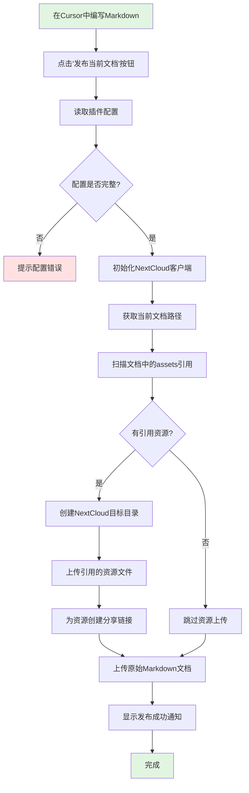
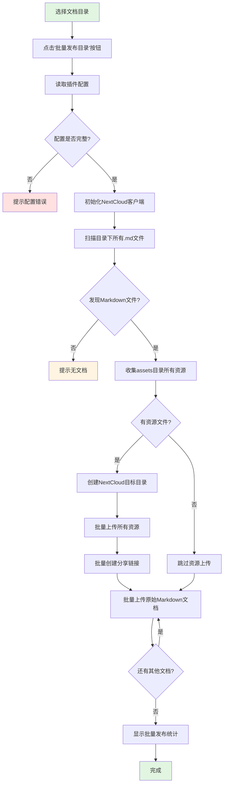

# 文档发布插件 (Cursor Plugin)

[](https://open-vsx.org/extension/chengang12345632/cursor-doc-publish-plugin)
[](https://github.com/chengang12345632/cursor-doc-publish-plugin/blob/main/LICENSE)

Cursor/VSCode 插件，用于在编辑器中一键发布项目文档到 NextCloud。

## 插件用途

在项目开发过程中，需要编写和维护各种文档（设计文档、需求文档、技术文档、API文档等）。本插件解决以下问题：

**问题场景**：
- 📝 项目文档包含大量图片、附件，直接提交到Git会导致仓库体积膨胀
- 🔗 图片资源分散存储，文档中的引用链接难以维护
- 🌐 需要将文档发布到团队共享平台（NextCloud），方便查阅和分享
- 🔄 手动上传资源、发布文档，操作繁琐易出错
- 💻 需要在编写文档后切换到终端执行命令，打断工作流

**解决方案**：
- ✅ 在项目中创建 `doc` 目录，在Cursor中编写Markdown文档
- ✅ 图片、PDF等资源放在 `assets` 目录，使用相对路径引用
- ✅ 在Cursor中点击按钮或执行命令，自动上传资源和文档到NextCloud
- ✅ 文档自动发布到NextCloud，Git仓库只保留Markdown文本
- ✅ 无需切换终端，在编辑器内完成整个发布流程

## 支持的文档类型

- 📋 **设计文档**：架构设计、详细设计、数据库设计
- 📄 **需求文档**：需求规格、用户故事、功能说明
- 🔧 **技术文档**：技术方案、调研报告、最佳实践
- 🌐 **API文档**：接口文档、API规范
- 📚 **开发文档**：开发指南、部署文档、运维手册
- 📊 **项目文档**：项目计划、会议记录、总结报告

## 核心功能

- 🔄 智能上传：只上传文档中实际引用的资源文件
- 📚 自动发布Markdown原始文档到NextCloud（保持相对路径引用）
- 📁 灵活的路径结构：目录名/[serviceName]/文档
- 🖱️ Cursor编辑器内一键发布，无需切换终端
- 📊 实时显示上传进度和结果
- 📄 支持单个文档发布和批量目录发布两种模式
- 🔗 为资源文件创建NextCloud分享链接（可选查看）
- 💾 节省存储：不上传未使用的资源文件

## 工作流程

### 单个文档发布流程



### 批量目录发布流程



**关键步骤**：
1. 在Cursor中编写文档
2. 选择发布模式：
   - 单个文档：快捷键 `Cmd/Ctrl + Shift + U`（只上传文档引用的资源）
   - 批量目录：右键目录 -> "Publish Directory to NextCloud"（收集所有文档引用的资源）
3. 智能上传：只上传被引用的资源文件，节省存储空间
4. 上传到：`basePath/目录名/[serviceName]/...`
5. 在Cursor中显示发布结果

---

## 📚 文档

- **[NextCloud 配置](docs/NEXTCLOUD_CONFIG.md)** - 详细配置说明
- **[应用专用密码指南](docs/APP_PASSWORD_GUIDE.md)** - 如何获取应用专用密码
- **[故障排查指南](docs/TROUBLESHOOTING.md)** - 常见问题解决方案
- **[开发指南](docs/DEVELOPMENT.md)** - 开发、调试、测试
- **[更新日志](CHANGELOG.md)** - 版本记录

---

## 快速开始

### ⚠️ 重要前置步骤

#### 1. 创建应用专用密码（必需）

**NextCloud WebDAV API 必须使用应用专用密码，不能使用登录密码！**

**获取步骤：**
```
登录 NextCloud 网页版
→ 头像 → 设置（Settings）
→ 安全（Security）
→ 应用密码（App passwords）
→ 输入名称（如：Cursor Doc Publisher）
→ 创建 → 复制密码（格式：xxxxx-xxxxx-xxxxx-xxxxx-xxxxx）
```

📖 **详细图文教程**：[应用专用密码获取指南](./docs/APP_PASSWORD_GUIDE.md)

#### 2. 在 NextCloud 创建根目录

**必须手动创建 basePath 目录：**

```
登录 NextCloud → 文件 → 新建文件夹
创建你的团队目录（如：/Docs）
```

插件会自动创建 basePath 下的所有子目录。

#### 3. 获取 WebDAV 文件空间地址（重要！）

**很多用户的 WebDAV 地址与登录用户名不同，需要单独获取：**

```
登录 NextCloud 网页版
→ 左下角点击 "文件设置"（齿轮图标）
→ 在设置面板左侧选择 "WebDAV"
→ 复制显示的 WebDAV 地址（如：https://your-domain/remote.php/dav/files/username_1234）
```

**关键信息：**
- **URL**：从 WebDAV 地址中提取 NextCloud 服务器地址
- **Username**：您的登录用户名（用于认证）
- **WebDAV文件空间用户名**：WebDAV 地址中的最后部分（如 `username_1234`）

📖 **详细说明**：[NextCloud 配置指南](./docs/NEXTCLOUD_CONFIG.md)

---

### 第1步：安装插件

**方式一：从 Cursor 扩展市场安装（推荐）**

1. 打开 Cursor
2. 按 `Ctrl/Cmd + Shift + X` 打开扩展面板
3. 搜索 "NextCloud Doc Publisher"
4. 点击 "Install"

**方式二：从命令行安装**

```bash
cursor --install-extension chengang12345632.cursor-doc-publish-plugin
```

**方式三：访问 OpenVSX**

👉 [OpenVSX Registry](https://open-vsx.org/extension/chengang12345632/cursor-doc-publish-plugin)

### 第2步：配置

```
Ctrl + , → 搜索 "NextCloud Doc Publisher"

必填项：
- NextCloud URL: https://your-nextcloud.com
- Username: your-username
- Password: xxxxx-xxxxx-xxxxx-xxxxx-xxxxx  ← 使用应用专用密码！
- Base Path: /Docs  ← 刚才创建的目录

可选项：
- Service Name: your-project  ← 项目标识（可以是服务名、项目名，留空则不创建此层级目录）
- WebDAV文件空间用户名: your-username_1234  ← 如果与登录用户名不同（企业环境可能需要）
```

⚠️ **重要说明**：
- Password 必须填写**应用专用密码**，不能填写登录密码！
- 如果 NextCloud 提示使用 `username_数字` 格式的 WebDAV 地址，请填写 WebDAV文件空间用户名

### 第3步：创建文档

```
doc/
└── V2.16.13/              ← 可选：版本目录（插件会自动保留）
    ├── test.md
    └── assets/
        └── image.png
```

### 第4步：发布

```
打开 test.md → Ctrl + Shift + U
```

完成！文档会上传到：
- 如果配置了 Service Name：`/Docs/V2.16.13/your-project/test.md`
- 如果 Service Name 为空：`/Docs/V2.16.13/test.md`

**说明**：
- 插件只保留文档所在目录的最后一级目录名（如 V2.16.13）
- Service Name 会作为目录的下一级（如果配置了）
- 只上传文档中实际引用的资源文件，不会上传整个 assets 目录

**遇到问题？**
- ✅ 执行测试连接：`Ctrl + Shift + P` → `Test Connection`
- ✅ 检查是否使用了应用专用密码（不是登录密码）
- ✅ 查看 [故障排查指南](./docs/TROUBLESHOOTING.md)

---

## 详细使用

以在 `base-server-service` 项目中发布文档为例。

### 步骤1：在项目中创建文档目录

在项目根目录下创建文档目录结构：

```bash
# 进入项目目录
cd base-server-service

# 方式一：按版本+文档类型组织（推荐）
mkdir -p doc/V2.16.13/design/assets
mkdir -p doc/V2.16.13/requirements/assets
mkdir -p doc/V2.16.13/api/assets

# 方式二：只按文档类型组织
mkdir -p doc/design/assets
mkdir -p doc/requirements/assets
mkdir -p doc/api/assets

# 方式三：直接在doc下组织
mkdir -p doc/assets
```

**推荐目录结构（方式一：版本+类型）**：

```
base-server-service/           # 项目根目录
├── src/
├── pom.xml
├── .cursor/
│   └── doc-publish-config.json # 插件配置文件（可选）
└── doc/                       # 文档根目录
    ├── V2.16.13/              # 版本目录
    │   ├── design/            # 设计文档
    │   │   ├── assets/
    │   │   └── (待创建.md文件)
    │   ├── requirements/      # 需求文档
    │   │   └── assets/
    │   ├── api/               # API文档
    │   │   └── assets/
    │   └── tech/              # 技术文档
    │       └── assets/
    └── V2.16.12/              # 历史版本
        └── ...
```

**简化目录结构（方式二：仅类型）**：

```
base-server-service/
└── doc/
    ├── design/
    │   ├── 设计文档.md
    │   └── assets/
    ├── api/
    │   ├── API文档.md
    │   └── assets/
    └── requirements/
        └── assets/
```

**最简目录结构（方式三：扁平）**：

```
base-server-service/
└── doc/
    ├── 设计文档.md
    ├── 需求文档.md
    ├── API文档.md
    └── assets/
```

**说明**：插件会自动保留您选择的目录结构，上传到NextCloud时保持一致。

### 步骤2：在Cursor中编写文档

**示例1：设计文档** `doc/V2.16.13/design/用户权限管理设计.md`

```markdown
# 用户权限管理设计文档

## 需求背景

本期需要实现基于RBAC的用户权限管理功能...

## 架构设计


## 数据模型


```

**示例2：API文档** `doc/V2.16.13/api/用户管理API.md`

```markdown
# 用户管理API文档

## 接口列表


## 详细说明

[接口详细文档](assets/api-detail.pdf)
```

**示例3：技术方案** `doc/V2.16.13/tech/缓存优化方案.md`

```markdown
# 缓存优化技术方案

## 方案对比


## 实施计划

[详细计划](assets/implementation-plan.xlsx)
```

**添加资源文件**：

将图片和文档拖拽到对应的 `assets/` 目录，或使用命令：

```bash
cp ~/architecture.png doc/V2.16.13/design/assets/
cp ~/api-detail.pdf doc/V2.16.13/api/assets/
```

**资源引用规范**：
- 使用相对路径：`assets/文件名`
- 图片：``
- 附件：`[链接文字](assets/xxx.pdf)`
- 上传后文档保持原始引用，在NextCloud中可正常访问

### 步骤3：发布文档到NextCloud

插件支持两种发布模式：
- **单个文档发布**：发布当前打开的Markdown文件
- **目录批量发布**：发布指定目录下的所有Markdown文件

#### 模式一：发布单个文档

适用于编写完成单个文档后快速发布。

**操作方式**：

**方式1：使用命令面板（推荐）**

1. 在Cursor中打开要发布的Markdown文档（如 `doc/V2.16.13/design/用户权限管理设计.md`）
2. 按 `Cmd/Ctrl + Shift + P` 打开命令面板
3. 输入 "Publish Current Doc to NextCloud"
4. 回车执行

**方式2：使用右键菜单**

1. 在文件树中右键点击要发布的Markdown文件
2. 选择 "Publish to NextCloud"

**方式3：使用快捷键**

- Mac: `Cmd + Shift + U`
- Windows/Linux: `Ctrl + Shift + U`

（需要在Cursor中打开要发布的文档）

**发布过程**：

```
[Publishing] Initializing NextCloud client...
[Publishing] Processing document: 用户权限管理设计.md
[Publishing] 扫描同级目录下的 assets/ 文件夹
[Publishing] Uploading assets... (1/3) architecture.png
[Publishing] Uploading assets... (2/3) data-model.png
[Publishing] Uploading assets... (3/3) api-design.pdf
[Publishing] Creating share links...
[Publishing] Uploading markdown document...
[Success] ✓ Published: 用户权限管理设计.md
[Success] ✓ URL: https://nextcloud.example.com/s/AbC123
```

#### 模式二：批量发布目录下的文档

适用于一次性发布多个文档或整个版本的文档。

**操作方式**：

**方式1：使用命令面板**

1. 按 `Cmd/Ctrl + Shift + P` 打开命令面板
2. 输入 "Publish Doc Directory to NextCloud"
3. 选择要发布的目录（如 `doc/V2.16.13/design/`）
4. 回车执行

**方式2：使用右键菜单（推荐）**

1. 在文件树中右键点击文档目录（如 `doc/V2.16.13/design/`）
2. 选择 "Publish Directory to NextCloud"

**方式3：使用快捷键**

- Mac: `Cmd + Option + Shift + U`
- Windows/Linux: `Ctrl + Alt + Shift + U`

（会发布当前打开文档所在的版本目录）

**发布过程**：

```
[Publishing] Initializing NextCloud client...
[Publishing] Scanning directory: doc/V2.16.13/design
[Publishing] Found 3 markdown file(s)
[Publishing] 收集目录下的所有资源文件
[Publishing] Uploading shared assets... (1/5) architecture.png
[Publishing] Uploading shared assets... (2/5) data-model.png
[Publishing] Uploading shared assets... (3/5) flow-chart.png
[Publishing] Uploading shared assets... (4/5) api-design.pdf
[Publishing] Uploading shared assets... (5/5) sequence.png
[Publishing] Creating share links...
[Publishing] Processing: 用户权限管理设计.md (1/3)
[Publishing] Processing: 数据迁移方案.md (2/3)
[Publishing] Processing: API接口设计.md (3/3)
[Success] ✓ Published 3 documents to: /Docs/base-server-service/doc/V2.16.13/design/
```

#### 两种模式的区别

**单个文档发布**：
- **发布范围**：当前打开的文档
- **assets处理**：只上传文档中引用的资源
- **速度**：快速
- **适用场景**：快速迭代、单文档更新
- **操作复杂度**：简单

**目录批量发布**：
- **发布范围**：目录下所有文档
- **assets处理**：收集所有文档引用的资源（去重）
- **速度**：相对较慢
- **适用场景**：首次发布、批量发布
- **操作复杂度**：需选择目录

#### 使用建议

**首次发布**：
- 使用"目录批量发布"，一次性发布所有文档

**日常更新**：
- 使用"单个文档发布"，快速发布修改的文档

**版本发布**：
- 使用"目录批量发布"，确保所有文档同步更新

### 步骤4：验证发布结果

发布成功后，Cursor会显示通知，包含NextCloud链接：

```
✓ 文档发布成功！
📂 查看文档: https://nextcloud.example.com/index.php/f/12345
```

点击链接访问NextCloud查看：

**如果配置了 serviceName = "base-server-service"：**
```
/Docs/
├── design/                          # 文档所在目录名
│   └── base-server-service/         # serviceName
│       ├── 用户权限管理设计.md
│       └── assets/
│           ├── architecture.png     # 只上传引用的文件
│           └── data-model.png
├── api/
│   └── base-server-service/
│       ├── 用户管理API.md
│       └── assets/
│           └── api-detail.pdf
└── tech/
    └── base-server-service/
        ├── 缓存优化方案.md
        └── assets/
            └── solution-comparison.png
```

**如果 serviceName 为空：**
```
/Docs/
├── design/                          # 文档所在目录名
│   ├── 用户权限管理设计.md
│   └── assets/
│       ├── architecture.png         # 只上传引用的文件
│       └── data-model.png
├── api/
│   ├── 用户管理API.md
│   └── assets/
│       └── api-detail.pdf
└── tech/
    ├── 缓存优化方案.md
    └── assets/
        └── solution-comparison.png
```

### 步骤5：提交到Git

**只提交Markdown文件，不提交资源文件**：

在Cursor中使用源代码管理面板：

1. 打开源代码管理：`Cmd/Ctrl + Shift + G`
2. 勾选 `doc/**/*.md` 文件
3. 确保 `assets/` 目录未被选中（应在 `.gitignore` 中）
4. 输入提交信息："docs: 添加用户权限管理文档"
5. 点击提交

**配置 `.gitignore`**：

```bash
# 添加到 .gitignore
echo "doc/**/assets/" >> .gitignore
echo ".cursor/doc-publish-config.json" >> .gitignore
```

**为什么不提交assets？**
- 资源文件已上传到NextCloud，无需在Git中保存
- 减小Git仓库体积
- Markdown中保持相对路径引用，在NextCloud中可正常访问

---

## 目录结构说明

### 本地项目结构（推荐）

```
base-server-service/           # 组件服务项目
├── src/
├── pom.xml
├── .cursor/
│   └── doc-publish-config.json # 插件配置文件
├── .gitignore
└── doc/                       # 项目文档根目录
    ├── V2.16.13/              # 当前版本
    │   ├── design/            # 设计文档
    │   │   ├── 用户权限管理设计.md
    │   │   ├── 数据迁移方案.md
    │   │   └── assets/
    │   ├── requirements/      # 需求文档
    │   │   ├── 用户故事.md
    │   │   └── assets/
    │   ├── api/               # API文档
    │   │   ├── 用户API.md
    │   │   └── assets/
    │   ├── tech/              # 技术文档
    │   │   └── assets/
    │   └── operations/        # 运维文档
    │       └── assets/
    └── V2.16.12/              # 历史版本
        └── ...
```

### NextCloud存储结构

**示例1：配置了 serviceName = "base-server-service"**

上传文档 `doc/V2.16.13/design/xxx.md`（引用了 assets/image.png），会创建：
```
/Docs/                         # basePath
└── V2.16.13/                  # 文档所在目录的最后一级
    └── base-server-service/   # serviceName（在目录下一级）
        ├── xxx.md
        └── assets/
            └── image.png      # 只上传引用的文件
```

**示例2：serviceName 为空**

上传文档 `doc/V2.16.13/design/xxx.md`（引用了 assets/image.png），会创建：
```
/Docs/                         # basePath
└── V2.16.13/                  # 文档所在目录的最后一级
    ├── xxx.md
    └── assets/
        └── image.png          # 只上传引用的文件
```

**示例3：批量上传目录**

选择目录 `doc/V2.16.13/design/`（包含多个文档，引用了部分资源），配置了 serviceName：
```
/Docs/
└── design/                    # 选择的目录名（最后一级）
    └── base-server-service/   # serviceName
        ├── 设计文档A.md
        ├── 设计文档B.md
        ├── subdir/            # 子目录结构保留
        │   └── 设计文档C.md
        └── assets/
            ├── image1.png     # 只上传被引用的文件
            └── image2.png     # 只上传被引用的文件
```

**组织原则**：
- 插件只使用目录的最后一级名称（如版本号），简化路径结构
- serviceName 作为目录的下一级，提供项目隔离
- 目录内的子目录结构会完整保留
- 只上传文档中实际引用的资源文件，节省存储空间
- serviceName 是可选的，可以留空

---

## 配置说明

### 插件配置项

**必填配置**：

- **nextcloud.url**
  - 说明：NextCloud服务器地址
  - 示例：https://nextcloud.example.com

- **nextcloud.username**
  - 说明：NextCloud用户名
  - 示例：deploy-user

- **nextcloud.password**
  - 说明：NextCloud密码（应用专用密码）
  - 示例：xxxxx-xxxxx-xxxxx

- **nextcloud.basePath**
  - 说明：NextCloud存储根路径
  - 示例：/Docs

**可选配置**：

- **project.serviceName**
  - 说明：项目标识（可以是服务名、项目名或其它，留空则不创建此层级目录）
  - 示例：base-server-service 或留空

- **nextcloud.webdavUsername**
  - 说明：WebDAV文件空间用户名（如果与登录用户名不同）
  - 示例：username_1234

**文档存储路径规则**：

**单个文档上传**：
- 只保留文档所在目录的最后一级目录名
- 如果本地是 `doc/V2.16.13/design/xxx.md`
- 上传到：
  - 有 serviceName：`{basePath}/design/{serviceName}/xxx.md`
  - 无 serviceName：`{basePath}/design/xxx.md`

**目录批量上传**：
- 只保留选择的目录名称（最后一级）
- 如果选择目录是 `doc/V2.16.13/design/`
- 上传到：
  - 有 serviceName：`{basePath}/design/{serviceName}/...`
  - 无 serviceName：`{basePath}/design/...`

**资源文件上传**：
- 只上传文档中实际引用的资源文件
- 不会上传整个 assets 目录
- 支持图片引用：``
- 支持附件引用：`[链接](assets/xxx.pdf)`

**说明**：
- 插件只使用目录的最后一级名称，不会创建多层父级目录
- serviceName 是目录的下一级（如果配置了）
- 目录内的子目录结构会完整保留
- serviceName 为可选配置，可以留空

### 配置文件示例

**完整配置示例** (`.cursor/doc-publish-config.json`)：

```json
{
  "nextcloud": {
    "url": "https://nextcloud.example.com",
    "username": "deploy-user",
    "password": "your-app-password",
    "basePath": "/Docs",
    "webdavUsername": "deploy-user_1234"
  },
  "project": {
    "serviceName": "base-server-service"
  }
}
```

**目录结构说明：**
- 插件会保留您本地的完整目录结构
- 支持在本地使用版本目录（如 `doc/V2.16.13/`），插件会自动上传并保留
- 默认上传所有资源文件和文档
- 默认覆盖已存在的文件

**配置项详解：**
- `url`：从 WebDAV 地址中提取的服务器地址（如：`https://docs.streamax.com:18001`）
- `username`：您的 NextCloud 登录用户名（用于认证）
- `password`：应用专用密码（不是登录密码！）
- `basePath`：您手动创建的根目录路径
- `webdavUsername`：WebDAV 地址中的用户名部分（如果与登录用户名不同）

**示例：**
如果您的 WebDAV 地址是：`https://docs.streamax.com:18001/remote.php/dav/files/chengang_3074`
- `url`: `https://docs.streamax.com:18001`
- `username`: `chengang`（您的登录用户名）
- `webdavUsername`: `chengang_3074`（WebDAV 地址中的用户名）

**使用环境变量**：

```json
{
  "nextcloud": {
    "url": "${env:NEXTCLOUD_URL}",
    "username": "${env:NEXTCLOUD_USERNAME}",
    "password": "${env:NEXTCLOUD_PASSWORD}",
    "basePath": "${env:NEXTCLOUD_BASE_PATH}"
  },
  "project": {
    "serviceName": "${env:SERVICE_NAME}"
  }
}
```

---

## 使用技巧

### 技巧1：根据场景选择发布模式

**场景A：编写完单个文档，立即发布**
- 使用"单个文档发布"
- 快捷键：`Cmd/Ctrl + Shift + U`
- 优势：速度快，只上传相关资源

**场景B：首次发布或版本发布**
- 使用"目录批量发布"
- 右键点击目录 -> "Publish Directory to NextCloud"
- 优势：确保所有文档同步

**场景C：更新已发布的文档**
- 修改文档后，使用"单个文档发布"
- 插件会自动覆盖NextCloud上的旧版本

### 技巧2：批量发布多个文档

如果在同一版本目录下有多个Markdown文档：

```
doc/V2.16.13/design/
├── 用户管理设计.md
├── 权限设计.md
├── 数据迁移方案.md
└── assets/
```

使用"目录批量发布"模式，插件会自动处理所有文档。

### 技巧3：按文档类型组织

推荐按文档类型创建子目录：

```bash
# 推荐：按版本组织（便于历史追溯）
doc/V2.16.13/design/
doc/V2.16.13/requirements/
doc/V2.16.13/api/
doc/V2.16.13/tech/

# 或：不使用版本目录
doc/design/
doc/requirements/
doc/api/
doc/tech/
```

发布时可以选择发布特定类型的文档。

### 技巧4：查看发布历史

Cursor插件会在输出面板显示详细日志：

1. 打开输出面板：`Cmd/Ctrl + Shift + U`
2. 选择 "NextCloud Doc Publisher" 通道
3. 查看发布历史和详细日志

### 技巧5：使用环境变量

在配置文件中使用环境变量，避免硬编码：

```json
{
  "project": {
    "serviceName": "${env:SERVICE_NAME}"
  }
}
```

---

## 故障排查

### 常见问题诊断

**检查配置**：

1. 在Cursor中打开命令面板：`Cmd/Ctrl + Shift + P`
2. 输入 "NextCloud Doc Publisher: Show Configuration"
3. 查看当前配置是否完整

**查看详细日志**：

1. 打开输出面板：`Cmd/Ctrl + Shift + U`
2. 选择 "NextCloud Doc Publisher" 通道
3. 查看详细执行日志

### 常见错误

#### 1. 配置不完整

**错误**：`NextCloud configuration is incomplete`

**原因**：必填的配置项未填写

**解决**：
1. 检查Cursor设置中的插件配置
2. 或检查 `.cursor/doc-publish-config.json` 文件
3. 确保所有必填项已填写

#### 2. 认证失败

**错误**：`401 Unauthorized`

**原因**：用户名或密码错误

**解决**：
- 确认用户名和密码正确
- 建议使用App Password而非主密码
- 尝试在NextCloud Web界面登录验证

#### 3. 权限不足

**错误**：`403 Forbidden`

**原因**：用户没有上传权限

**解决**：
- 在NextCloud中检查用户权限
- 确认目标目录可写
- 尝试在Web界面手动上传测试

#### 4. 文件未找到

**错误**：`No markdown files found`

**原因**：文档目录不存在或路径配置错误

**解决**：
```bash
# 检查目录是否存在
ls -la doc/

# 检查是否有Markdown文件
find doc -name "*.md"
```

#### 5. 资源文件未上传

**现象**：Markdown发布了，但图片显示不出来

**原因**：assets目录为空或路径不对

**解决**：
```bash
# 检查assets目录
ls -la doc/V2.16.13/design/assets/

# 确认Markdown中的引用路径
grep "assets/" doc/**/*.md
```

#### 6. 插件未响应

**现象**：点击按钮或执行命令无反应

**解决**：
1. 重启Cursor：`Cmd/Ctrl + Shift + P` -> "Reload Window"
2. 检查插件是否正常加载：查看扩展列表
3. 查看Cursor开发者工具：`Help` -> `Toggle Developer Tools`

---

## 常见问题

**Q1: 如何验证插件配置正确？**

A: 在命令面板中执行：
```
1. 按 Cmd/Ctrl + Shift + P 打开命令面板
2. 输入 "NextCloud Doc Publisher: Test Connection"
3. 查看连接测试结果
```
插件会测试NextCloud连接、验证配置并显示详细诊断信息。

**Q2: 如何获取正确的 WebDAV 地址？**

A: 按照以下步骤获取：
```
1. 登录 NextCloud 网页版
2. 左下角点击 "文件设置"（齿轮图标）
3. 在设置面板左侧选择 "WebDAV"
4. 复制显示的 WebDAV 地址
5. 从地址中提取：
   - url: 服务器地址部分
   - webdavUsername: 地址最后的用户名部分
```

**示例：**
- WebDAV 地址：`https://docs.streamax.com:18001/remote.php/dav/files/chengang_3074`
- 配置：
  - `url`: `https://docs.streamax.com:18001`
  - `webdavUsername`: `chengang_3074`

**Q3: 支持哪些资源文件格式？**

A: 支持所有格式，包括：
- 图片：png、jpg、gif、svg、webp
- 文档：pdf、docx、xlsx、pptx
- 其他：txt、json、xml、zip等

**Q4: 多个文档如何管理？**

A: 在同一版本目录下创建多个.md文件，插件会自动处理所有文档：
```
doc/V2.16.13/design/
├── 设计文档A.md
├── 设计文档B.md
├── 设计文档C.md
└── assets/
```

**Q5: 资源文件更新后需要重新发布吗？**

A: 是的。如果修改了assets中的文件，需要重新执行发布命令，插件会自动覆盖旧文件。

**Q6: NextCloud分享链接无法访问？**

A: 检查以下几点：
- NextCloud分享功能是否启用
- 分享链接权限是否为"公开"
- 网络是否可访问NextCloud服务器
- 防火墙或代理设置

**Q7: 如何删除已发布的文档？**

A: 登录NextCloud Web界面，在 `/Docs/{SERVICE_NAME}/` 目录下手动删除。

**Q8: 插件是否支持离线工作？**

A: 插件需要网络连接才能上传到NextCloud。编写文档可以离线进行，发布时需要联网。

**Q9: 可以发布非设计类的文档吗？**

A: 可以！插件支持发布任何类型的Markdown文档，包括需求文档、技术方案、API文档、运维手册等。

**Q10: 如何组织不同类型的文档？**

A: 插件支持任意目录结构，推荐以下几种方式：

**推荐方式（版本+类型）：**
```
doc/
├── V2.16.13/          # 当前版本
│   ├── design/        # 设计文档
│   ├── requirements/  # 需求文档
│   ├── api/          # API文档
│   └── tech/         # 技术文档
└── V2.16.12/          # 历史版本
```

**简化方式（仅类型）：**
```
doc/
├── design/      # 设计文档
├── requirements/ # 需求文档
├── api/         # API文档
└── tech/        # 技术文档
```

插件会完整保留您选择的任何目录结构。

**Q11: 单个文档发布和批量发布有什么区别？**

A: 主要区别：
- **单个文档发布**：只发布当前打开的文档，只上传该文档引用的资源，速度快
- **批量发布**：发布整个目录下的所有文档，上传所有资源，确保完整性

建议：日常更新用单个发布，首次发布或版本发布用批量发布。

**Q12: 如何只发布单个文档而不发布整个目录？**

A: 
1. 在Cursor中打开要发布的Markdown文件
2. 按 `Cmd/Ctrl + Shift + U`（快捷键）
3. 或在文件树中右键点击该文件 -> "Publish to NextCloud"

**Q13: 发布单个文档时，其他文档会受影响吗？**

A: 不会。单个文档发布只会：
- 上传/更新当前文档
- 上传/更新当前文档引用的资源
- 不会影响目录下的其他文档

**Q14: 批量发布会覆盖之前发布的文档吗？**

A: 会。批量发布会：
- 上传目录下的所有Markdown文件
- 如果NextCloud已存在同名文档，会被覆盖
- 所有资源文件也会被重新上传

---

## 技术原理

### 工作机制

**单个文档发布流程**：
1. **配置读取**：从Cursor设置或项目配置文件读取NextCloud连接信息
2. **当前文档解析**：获取当前打开的Markdown文件路径
3. **路径分析**：提取文档所在目录的最后一级目录名
4. **资源分析**：扫描文档中引用的资源文件（如 ``）
5. **资源上传**：只上传文档引用的资源到NextCloud
6. **分享链接生成**：为上传的资源创建公开分享链接
7. **文档上传**：上传到 `basePath/目录名/[serviceName]/文件名`
8. **结果反馈**：显示发布成功通知和文档链接

**批量目录发布流程**：
1. **配置读取**：从Cursor设置或项目配置文件读取NextCloud连接信息
2. **目录扫描**：扫描指定目录下的所有 `.md` 文件
3. **路径分析**：提取选择目录的最后一级目录名
4. **资源收集**：收集所有文档中引用的资源文件（去重）
5. **资源上传**：只上传被引用的资源到NextCloud
6. **分享链接生成**：调用NextCloud Sharing API为每个资源创建公开分享链接
7. **批量上传**：上传到 `basePath/目录名/[serviceName]/子路径`
8. **结果反馈**：显示批量发布统计信息

### 技术栈

- **Cursor Extension API**：Cursor插件开发框架
- **Node.js**：插件运行环境
- **Sardine/WebDAV Client**：WebDAV协议文件上传
- **Axios**：HTTP客户端，调用NextCloud Sharing API
- **正则表达式**：Markdown语法解析和资源引用扫描

### 关键实现

**资源文件扫描**：

```javascript
// 单个文档：扫描文档中引用的资源
const assets = MarkdownService.scanAssetReferences(markdownPath);
// 匹配  和 [...](assets/xxx)

// 目录发布：收集所有文档引用的资源（去重）
const allAssetsMap = new Map<string, AssetInfo>();
markdownFiles.forEach(mdFile => {
  const assets = MarkdownService.scanAssetReferences(mdFile);
  assets.forEach(asset => {
    if (!allAssetsMap.has(asset.localPath)) {
      allAssetsMap.set(asset.localPath, asset);
    }
  });
});
const allAssets = Array.from(allAssetsMap.values());
```

**WebDAV上传路径**：

**单个文档上传**：
```
{NEXTCLOUD_URL}/remote.php/dav/files/{USERNAME}/{BASE_PATH}/{文档所在目录名}/[{SERVICE_NAME}/]{文件名}
```

**目录批量上传**：
```
{NEXTCLOUD_URL}/remote.php/dav/files/{USERNAME}/{BASE_PATH}/{选择的目录名}/[{SERVICE_NAME}/]{子路径}
```

**说明**：
- 路径结构：`basePath/目录名/[serviceName]/文件`
- `[{SERVICE_NAME}/]` 表示可选，如果 serviceName 为空则跳过这一层
- serviceName 在目录名的下一级，不是在 basePath 下
- 只使用目录的最后一级名称，不创建多层父级目录
- 目录内的子目录结构会完整保留

**进度通知**：

```javascript
vscode.window.withProgress({
  location: vscode.ProgressLocation.Notification,
  title: "Publishing Document",
  cancellable: false
}, async (progress) => {
  // 上传逻辑
});
```

---

## 插件开发

如果您想参与插件开发或自定义功能，请查看详细的开发文档：

📖 **[开发指南](docs/DEVELOPMENT.md)** - 包含完整的开发、调试、打包和发布说明

**快速开始**：

```bash
# 克隆仓库
git clone https://github.com/chengang12345632/cursor-doc-publish-plugin.git
cd cursor-doc-publish-plugin

# 安装依赖
npm install

# 启动调试
# 在 Cursor 中按 F5 启动调试模式
```

**贡献指南**：

欢迎提交 Issue 和 Pull Request！提交前请确保：
- 代码通过 TypeScript 编译
- 更新相关文档
- 遵循项目代码规范

---

## 注意事项

1. **配置文件安全**
   - 将 `.cursor/doc-publish-config.json` 加入 `.gitignore`
   - 优先使用App Password而非主密码
   - 避免将密码明文提交到Git仓库

2. **项目标识规范**
   - 使用简洁、有意义的标识符
   - 示例：base-server-service、user-service、my-project

3. **版本目录建议**
   - 推荐在本地使用版本目录组织文档（如：`doc/V2.16.13/`）
   - 插件会自动保留版本目录结构
   - 便于历史追溯和版本管理
   - 格式建议：`V{主版本}.{次版本}.{修订版本}`

4. **资源引用规范**
   - 使用指向`assets/`的相对路径引用
   - 上传后保持原始引用格式
   - 不要使用`../`等复杂相对路径
   - HTTP/HTTPS链接保持不变

5. **Git提交建议**
   - 只提交`.md`文件到Git
   - 将`doc/**/assets/`加入`.gitignore`
   - 资源文件已在NextCloud，无需版本控制

6. **网络要求**
   - 发布时需要网络连接到NextCloud服务器
   - 建议在稳定网络环境下发布
   - 大文件上传可能需要较长时间

7. **NextCloud权限**
   - 确保用户有目标目录的写入权限
   - 确保有创建公开分享链接的权限
   - 首次使用需手动创建 `/Docs` 根目录

---

**文档版本**: V14.0 (优化路径规则和资源上传逻辑)  
**最后更新**: 2025-01-17  
**主要更新**:
- 🎯 优化路径规则：serviceName 放在目录名的下一级（`basePath/目录名/serviceName/`）
- 🚀 智能资源上传：只上传文档中实际引用的资源文件，不再上传整个 assets 目录
- 💾 节省存储空间：自动过滤未使用的资源文件
- 📝 更新所有示例和说明，展示新的路径结构
- 🔧 Service Name 保持可选配置
